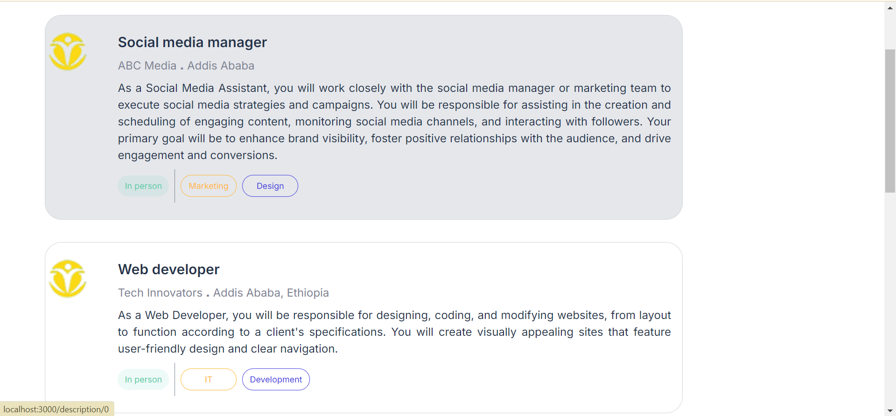
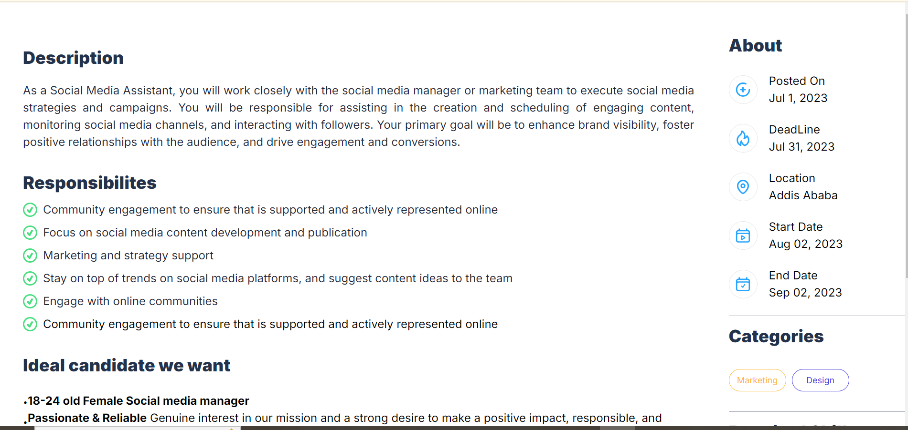
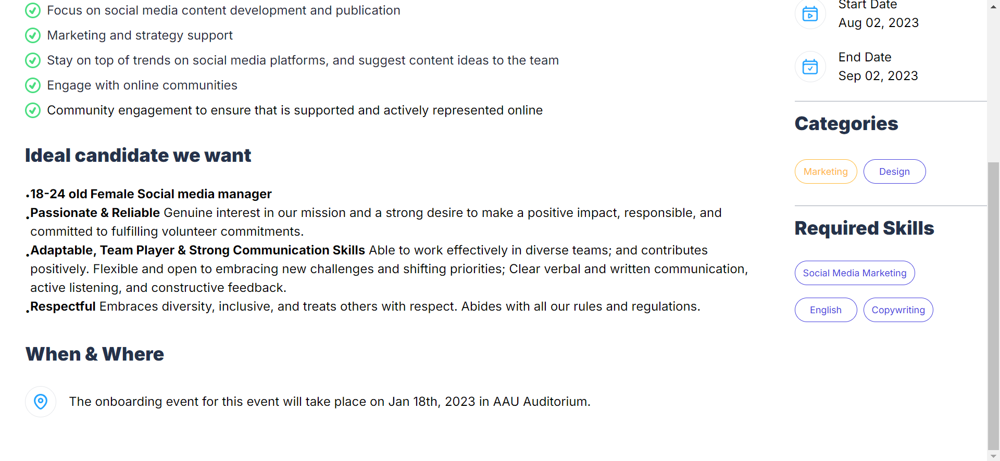

## Job Listing
A simple job portal website built with Next.js, TypeScript, and Tailwind CSS. It provides a list of available job positions for users to find. The job details are stored in jobs.json located in the _data/ folder.

## images of the pages
## /jobs

## /description/[id]

## Features
Job Listings: Displays a list of available job positions.

Job Descriptions: Provides detailed descriptions of each job.

User Navigation: Easy navigation between job listings and detailed views.

## Technologies Used
Next.js - A React framework for server-rendered applications.

TypeScript - A strongly typed programming language that builds on JavaScript.

Tailwind CSS - A utility-first CSS framework for rapid UI development.

React Icons - A popular icon library for React applications.

## Installation
To run this project locally, follow these steps:

1.Clone the repository:

2.Install dependencies:

3.Run the development server:

4.Open http://localhost:3000 in your browser to see the application.

## Usage

Visit the /jobs route to see the list of available jobs.
Click on a job listing to navigate to /description/[id] for detailed information about the job.

## Contributing

Contributions are welcome! Please fork the repository and submit a pull request.